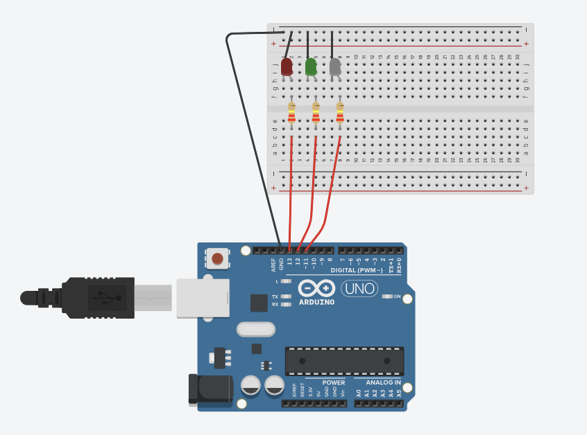
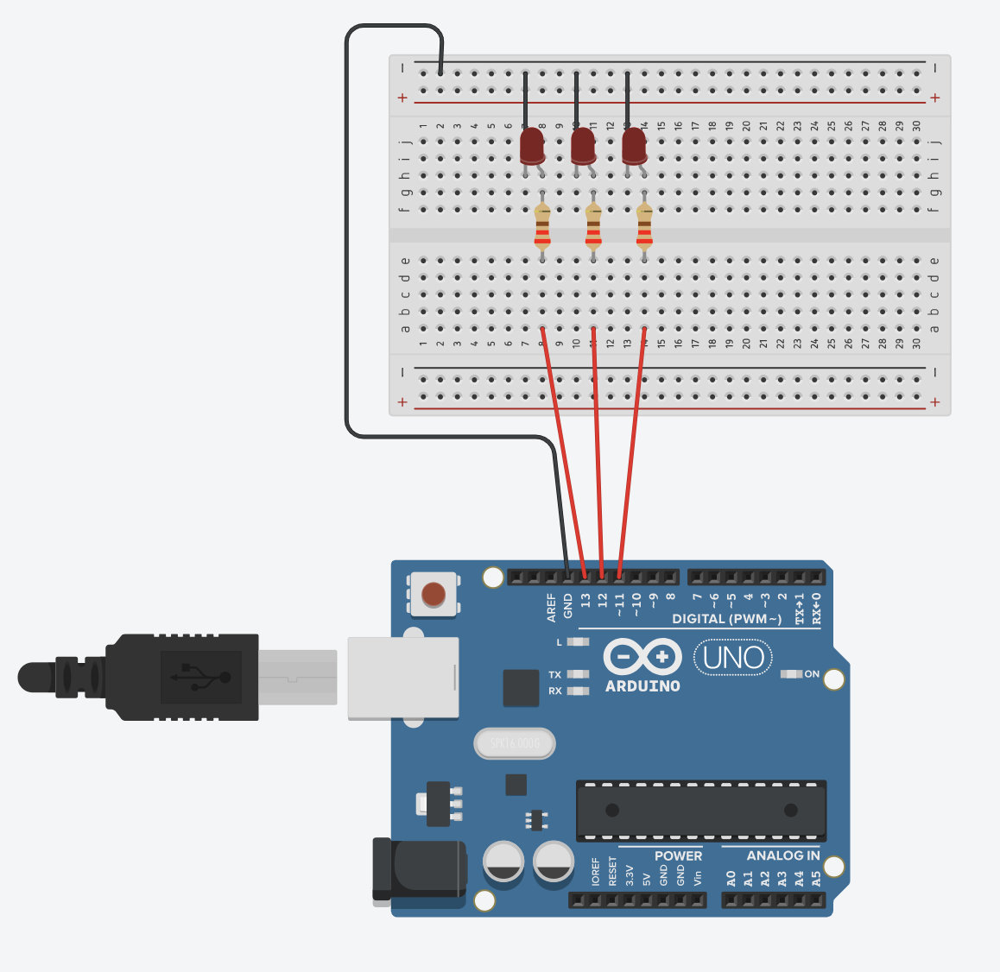
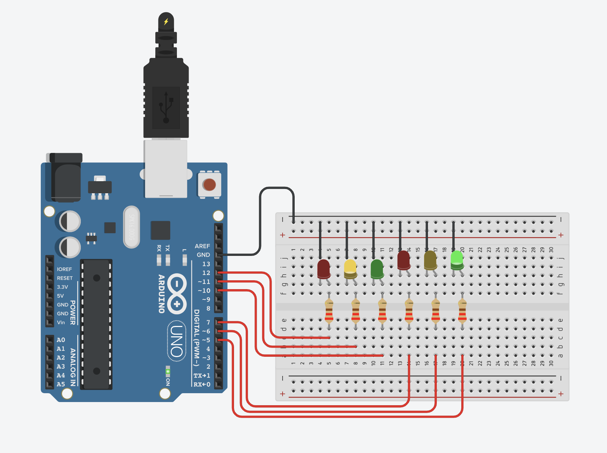

# Arduino Uno
### [Português]

**[Experimento 1](Exp1.ino):** 
>Montar o circuito abaixo e configurar os pinos 11, 12 e 13 como saídas e mantê-los acionados. Resistores configurados para 220 Ohms.

**[Experimento 2](Exp2.ino):**
>Configurar os pinos 11, 12 e 13 como saídas e programe o arduino para piscar um led de cada vez de forma alternada a cada 1 segundo. Resistores configurados para 220 Ohms.

**[Experimento 3](Exp3.ino):**
>Desenvolva um algoritmo que simula um cruzamento com semáforo, usem os pinos 12, 11, 10, 7, 6 e 5 como saídas. Resistores configurados para 220 Ohms.

### [English]
**[Experiment 1](Exp1.ino):**
>Mount the circuit below and configure pins 11, 12 and 13 as outputs and keep them on. Resistors configured for 220 Ohms.

**[Experiment 2](Exp2.ino):**
>Configure pins 11, 12 and 13 as outputs and program the arduino to flash one led at a time alternately every 1 second. Resistors configured for 220 Ohms.

**[Experiment 3](Exp3.ino):**
>Develop an algorithm that simulates a crossing with traffic lights, use pins 12, 11, 10, 7, 6 and 5 as outputs. Resistors configured for 220 Ohms.

### [Español]
**[Experimento 1](Exp1.ino):**
>Montar el circuito a continuación y configurar los pines 11, 12 y 13 como salidas y mantenerlos activados. Resistores configurados para 220 Ohms.

**[Experimento 2](Exp2.ino):**
>Configure los pines 11, 12 y 13 como salidas y programe el arduino para que parpadee un led a la vez alternativamente cada 1 segundo. Resistores configurados para 220 Ohms.

**[Experimento 3](Exp3.ino):**
>Desarrolle un algoritmo que simule un cruce con semáforos, use los pines 12, 11, 10, 7, 6 y 5 como salidas. Resistores configurados para 220 Ohms.

